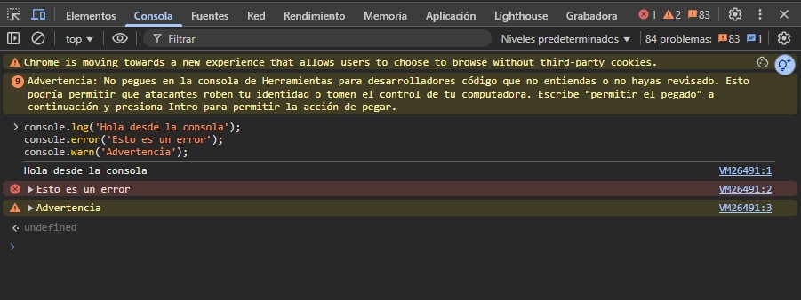
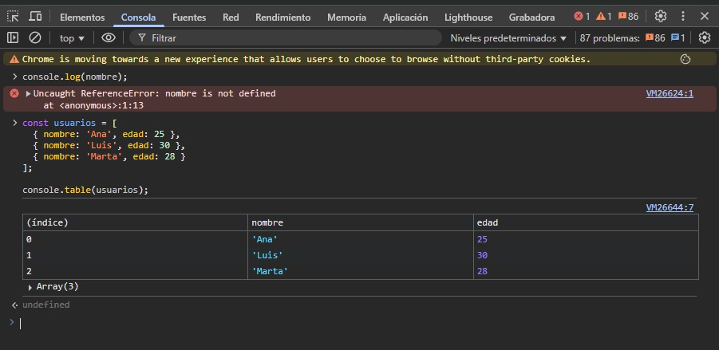

La pestaña **Consola** del Inspector de Elementos es una herramienta esencial para depurar y experimentar con JavaScript directamente en el contexto de la página web que estás inspeccionando.

Permite registrar mensajes, detectar errores en el código, ver advertencias del navegador y ejecutar código JavaScript en tiempo real.

---

## 🧠 ¿Qué es la Consola?

La consola es una interfaz interactiva en la que puedes:

- Leer mensajes generados por el navegador.
- Ver resultados de scripts o interacciones con la página.
- Escribir y ejecutar código JavaScript directamente.

---

## 🛠️ Funcionalidades clave

### 1. **Ver errores y advertencias**

La consola muestra:

- ❌ Errores de JavaScript que interrumpen la ejecución.
- ⚠️ Advertencias sobre buenas prácticas, accesibilidad, rendimiento, etc.
- ℹ️ Mensajes informativos que tú o librerías externas pueden registrar.

Estos mensajes son esenciales para detectar fallos y entender el comportamiento inesperado de una aplicación.

---

### 2. **Depurar con `console.log()`**

Puedes insertar funciones como:

```js
console.log("Hola desde la consola");
console.error("Esto es un error");
console.warn("Advertencia");
```

Estos mensajes se mostrarán directamente en la consola durante la ejecución del sitio.


### 3. Ejecutar código JavaScript en tiempo real

Escribe cualquier línea de código en la consola y obtén el resultado de inmediato. Por ejemplo:

```js
const titulo = document.querySelector("h1");
titulo.style.color = "red";
titulo.style.fontSize = "3rem";
```

Esto te permite experimentar, validar funciones o modificar el DOM sin tocar el código fuente.

### 4. Visualizar datos con console.table()

Cuando tienes arreglos de objetos (por ejemplo, respuestas JSON), puedes mostrarlos de forma ordenada con:

```js
const usuarios = [
  { nombre: "Ana", edad: 25 },
  { nombre: "Luis", edad: 30 },
  { nombre: "Marta", edad: 28 },
];

console.table(usuarios);
```


### 5. Historial y autocompletado

Usa las flechas ↑ y ↓ para navegar por comandos anteriores.

La consola incluye autocompletado para funciones y propiedades del DOM.

---

### 🧪 ¿Cuándo usar la consola?

- Para depurar funciones JavaScript.

- Para validar variables o estructuras de datos.

- Para manipular el DOM directamente.

- Para experimentar con nuevas ideas sin modificar archivos reales.

- Para inspeccionar interacciones con eventos, formularios o APIs.

La consola no es solo para errores: es un laboratorio donde puedes probar, modificar y aprender JavaScript directamente desde el navegador. Una herramienta imprescindible para cualquier desarrollador web.
