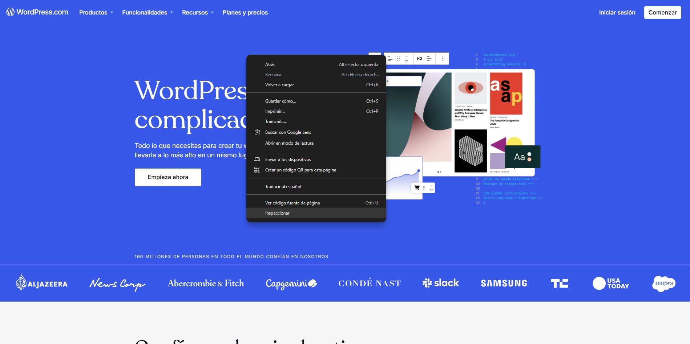
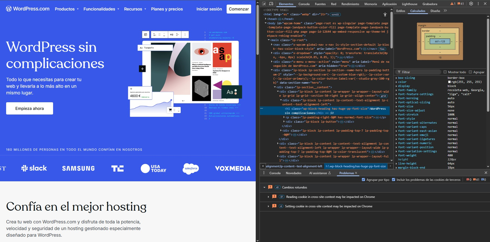
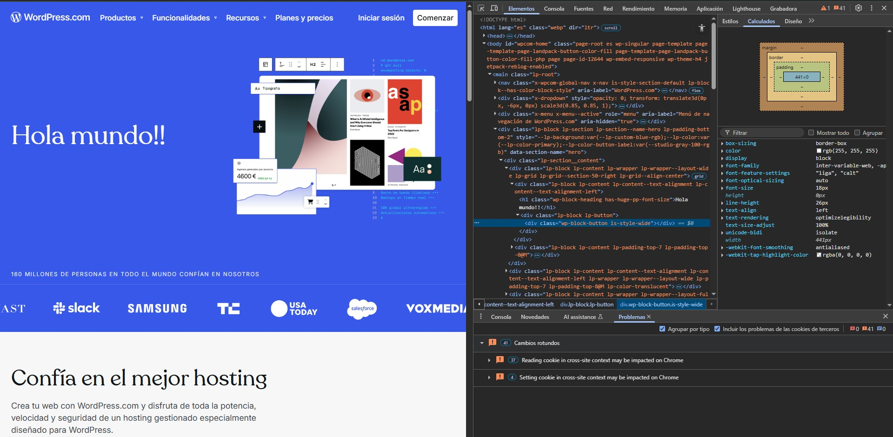
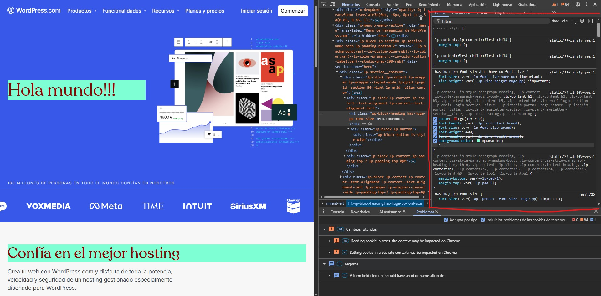
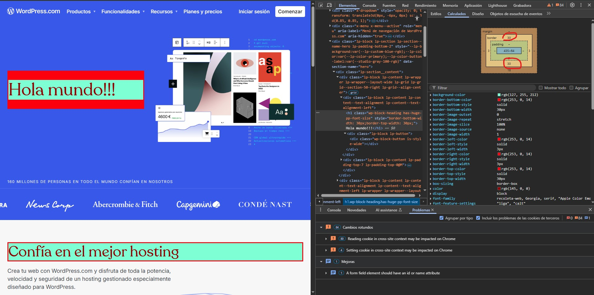
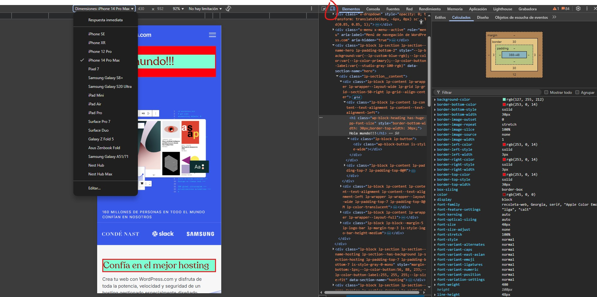
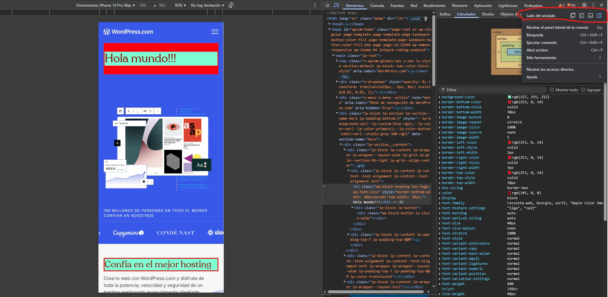

La pestaña **Elementos** del Inspector de Elementos es una de las herramientas más poderosas para desarrolladores web. Permite examinar y editar la estructura de una página HTML y sus estilos CSS en tiempo real, sin modificar el código fuente original del servidor.

---

## 🔍 ¿Qué es el DOM?

El **DOM (Document Object Model)** es una representación estructurada del HTML de una página, organizada como un árbol de nodos. Cada etiqueta HTML se convierte en un nodo que puede ser inspeccionado, modificado, movido o eliminado directamente desde esta pestaña.

---

## 🛠️ Funcionalidades clave

### 1. **Inspeccionar un elemento específico**
Puedes hacer clic derecho sobre cualquier parte de la página y seleccionar **"Inspeccionar"** para abrir DevTools directamente enfocado en ese elemento.

- También puedes usar la herramienta de selección (el icono de puntero en la esquina superior izquierda de DevTools) para hacer clic sobre un elemento y verlo en el DOM.




### 2. **Explorar la estructura HTML**
Una vez seleccionado un elemento, el panel izquierdo mostrará su posición exacta dentro del árbol DOM, junto con sus elementos padre, hijos y atributos.



### 3. **Editar HTML directamente**
Haz doble clic sobre cualquier etiqueta, atributo o contenido textual para editarlo:

```html
<h1 class="titulo">Hola mundo</h1>
```
También puedes hacer clic derecho sobre cualquier nodo del DOM para eliminarlo, duplicarlo o agregarle nuevos elementos hijos.



### 4. **Modificar CSS con la pestaña "Styles"**
En el panel derecho, puedes editar los estilos CSS de forma interactiva:

- Cambiar valores de propiedades como color, tamaño, bordes, etc.
- Añadir nuevas reglas.
- Activar o desactivar estilos temporalmente.
- Ver qué archivos y selectores aplican los estilos actuales.



:::tip[Consejo]

Esto es ideal para hacer pruebas rápidas sin modificar el código fuente.Pero ten en cuenta que 
los cambios que hagas en la DevTools se borraran al recargar la pagina. Guarda los cambios que hayas hecho en tu archivo css. 

:::

### 5. **Ver y ajustar el modelo de caja con "Computed"**
La pestaña **"Computed"** (o "Calculado") muestra una vista visual del box model:

- Puedes ver el **padding**, **border**, **margin** y tamaño del **contenido**.
- Al pasar el cursor sobre cada sección, se resalta en la página el área correspondiente.
- Es útil para depurar espacios inesperados o superposiciones de elementos.



### 6. **Modo responsive design**
Haz clic en el icono de **dispositivos** (📱) en la barra superior de DevTools o presiona **Ctrl+Shift+M** / **Cmd+Shift+M**.

- Te permitirá ver cómo se ve la página en distintos tamaños de pantalla (móvil, tablet, escritorio).
- Puedes simular dispositivos populares como iPhone o Galaxy.
- También puedes rotar la vista y controlar el nivel de zoom.


### 7. **Mover el panel DevTools**
DevTools puede mostrarse:

- A la derecha
- Abajo
- En una ventana separada

Haz clic en los tres puntos verticales (⋮) en la esquina superior derecha de DevTools → selecciona la opción de acoplamiento que prefieras.


---

## 💡 Tips prácticos

- Usa **Ctrl + Shift + C** o **Cmd + Shift + C** para activar rápidamente el selector de elementos.
- Prueba cambios directamente en el navegador antes de editarlos en tu código real.
- Ideal para aprender cómo se aplican ciertos efectos visuales como `:hover`, `:focus`, etc.

---

## 🧪 ¿Cuándo usar esta pestaña?

- Para hacer pruebas de diseño rápidamente.
- Para depurar problemas de maquetación o estilos rotos.
- Para entender cómo está construida una página web.
- Para copiar estructuras HTML o estilos de páginas que te gusten.

