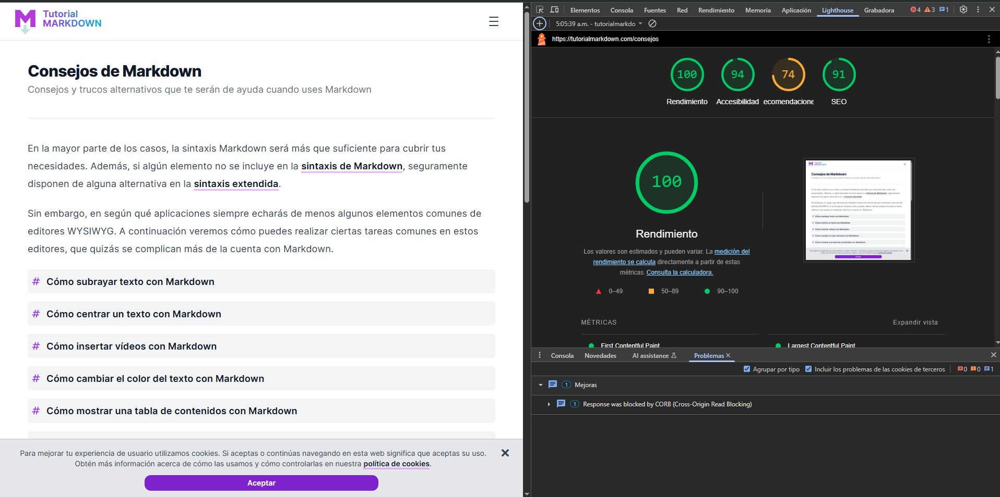

La pestaña **Lighthouse** de DevTools permite generar un informe automatizado sobre el rendimiento, accesibilidad, buenas prácticas, SEO y experiencia de usuario en dispositivos móviles y de escritorio.

Es una herramienta esencial para desarrolladores que desean optimizar sus sitios web y detectar áreas de mejora.

---

## 🚀 ¿Qué es Lighthouse?

**Lighthouse** es un conjunto de auditorías automatizadas que evalúan la calidad de una página web. Se ejecuta desde DevTools o desde la línea de comandos y genera un reporte con puntuaciones y recomendaciones.

Puede usarse en cualquier página pública o que estés desarrollando localmente.

---

## 📊 Métricas que evalúa Lighthouse

### 1. **Performance (Rendimiento)**

Evalúa la velocidad de carga de la página y su tiempo de respuesta, incluyendo:

- Tiempo hasta el primer renderizado (FCP)
- Tiempo hasta que la página es interactiva (TTI)
- Largest Contentful Paint (LCP)
- Total Blocking Time (TBT)
- Cumulative Layout Shift (CLS)

### 2. **Accesibilidad**

Revisa si tu sitio es usable por personas con discapacidad:

- Contraste de color
- Etiquetas en formularios
- Navegación por teclado
- Textos alternativos en imágenes

### 3. **Best Practices**

Recomienda mejoras relacionadas con:

- Uso seguro de APIs
- Evitar vulnerabilidades comunes
- Buenas prácticas de codificación

### 4. **SEO**

Evalúa si tu sitio está optimizado para buscadores:

- Etiquetas `<title>` y `<meta description>`
- Uso correcto de enlaces
- Contenido indexable

### 5. **PWA (Progressive Web App)**

Verifica si tu sitio cumple con los requisitos para ser una aplicación web progresiva:

- Manifest.json
- Service Workers
- Experiencia offline

---

## ⚙️ Cómo usar Lighthouse

1. Abre DevTools (`F12` o `Ctrl+Shift+I`).
2. Ve a la pestaña **Lighthouse**.
3. Elige si quieres analizar la versión móvil o de escritorio.
4. Selecciona las auditorías que deseas ejecutar.
5. Haz clic en **Analyze page load**.

Lighthouse ejecutará las pruebas y mostrará un reporte interactivo con puntuaciones del 0 al 100 en cada categoría, junto con sugerencias para mejorar.

---

## 🧪 ¿Cuándo usar esta pestaña?

- Al lanzar un nuevo sitio web o funcionalidad.
- Para identificar cuellos de botella en el rendimiento.
- Para mejorar la accesibilidad o el SEO.
- Para validar si tu app puede ser instalada como PWA.

---

Lighthouse es como un chequeo médico completo para tu sitio web: te ayuda a detectar problemas, optimizar la experiencia del usuario y seguir buenas prácticas recomendadas por Google.
