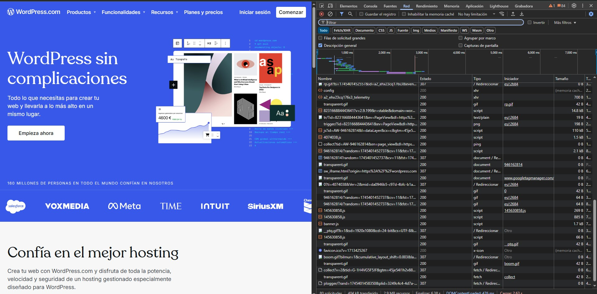

La pestaña **Red** (o "Network") del Inspector de Elementos permite ver en detalle todas las solicitudes que realiza una página web: archivos, peticiones API, imágenes, scripts y más.

Es una herramienta esencial para diagnosticar problemas de carga, rendimiento y comunicación con servidores.

---

## 🌐 ¿Qué muestra la pestaña Red?

Cada vez que cargas o interactúas con una página, esta pestaña registra todas las solicitudes HTTP que se generan.

Puedes ver:

- Tipo de archivo (documento, imagen, script, etc.).
- Estado de la solicitud (200, 404, 500...).
- Tiempo de carga.
- Tamaño del archivo.
- Encabezados y cuerpo de las respuestas.

---

## 🛠️ Funcionalidades clave

### 1. **Ver todas las solicitudes de la página**

Al recargar la página con la pestaña abierta, se listan todos los recursos cargados:

- Puedes filtrar por tipo: `All`, `Doc`, `XHR`, `JS`, `CSS`, `Img`, `Media`, `Font`, etc.
- Ver si hubo errores, tiempos de espera o archivos lentos.
- Evaluar si algún recurso está siendo bloqueado por el navegador o alguna política CORS.

---

### 2. **Analizar peticiones a APIs**

Cuando una web hace llamadas a servidores externos (AJAX o Fetch), se reflejan como tipo `XHR` o `Fetch`:

- Puedes inspeccionar los datos enviados en la pestaña **Payload**.
- Ver la respuesta en **Response** (JSON, HTML, texto plano).
- Examinar los encabezados HTTP y verificar autenticación, cookies, tipo de contenido, etc.

```json
{
  "nombre": "Juan",
  "edad": 28
}
```
Esto es clave para depurar llamadas API.

### 3. Revisar tiempos de carga
Cada solicitud tiene una pequeña barra de tiempo que indica:

* Cuánto tardó en resolverse.

* Si fue descargada desde caché o desde el servidor.

* Cuál fue el cuello de botella (DNS, espera, transferencia).

Esto te ayuda a optimizar el rendimiento general de una página.



---

### 4. Guardar y exportar tráfico
Puedes guardar toda la sesión de red como archivo .har para:

* Compartirlo con otros desarrolladores.

* Adjuntarlo en reportes de bugs.

* Comparar tiempos entre distintas pruebas.

---

### 🧪 ¿Cuándo usar esta pestaña?
* Para depurar llamadas AJAX o Fetch.

* Para identificar por qué algo no se carga.

* Para entender cómo funciona una aplicación del lado del cliente.

* Para detectar cuellos de botella en la red.

* Para revisar headers, cookies, CORS y contenido dinámico.

---

La pestaña Red es como un escáner de rayos X para cualquier web: revela lo que está pasando "bajo el capó" en términos de comunicación entre el navegador y los servidores. Es indispensable para desarrolladores frontend, backend y testers.